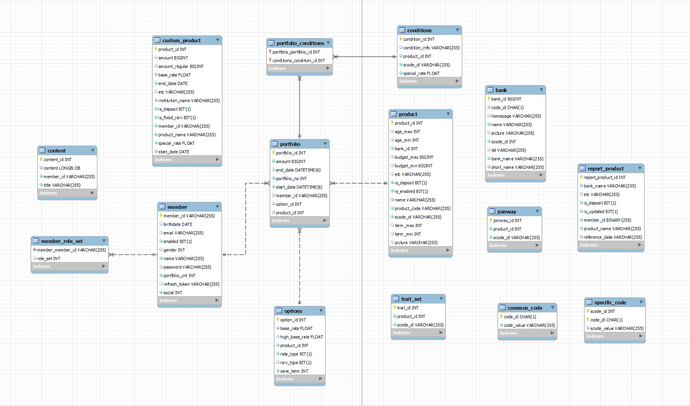
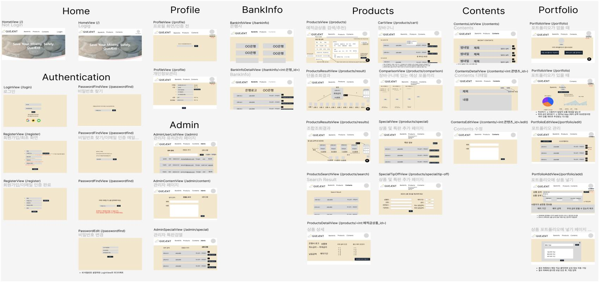
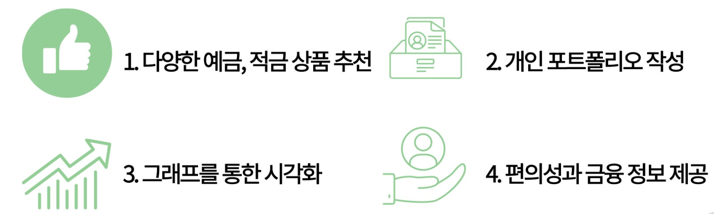
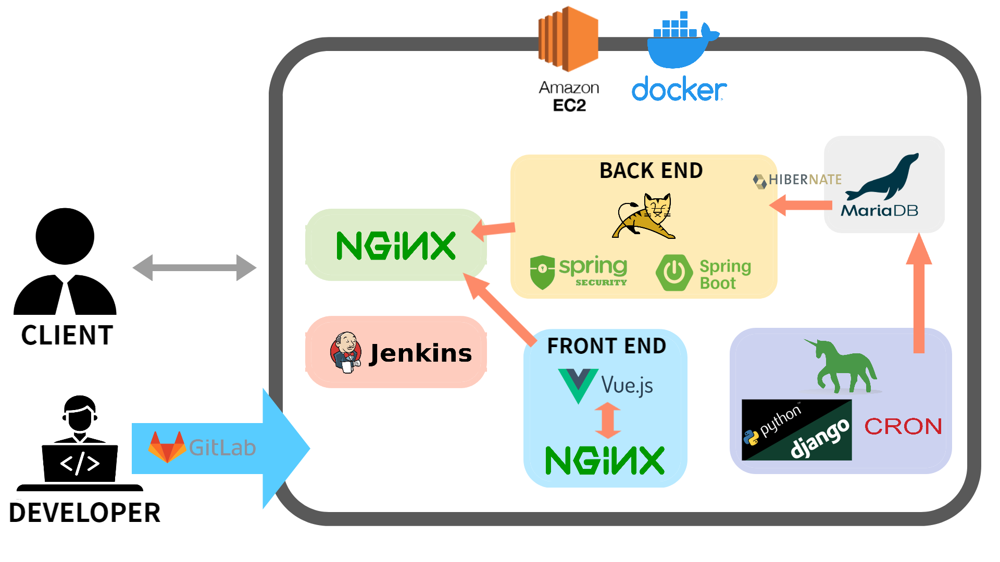

&nbsp;

프로젝트의 이름은 'QueÆnt' 로, 여왕개미(QueenAnt) 의 약자를 의미합니다.   
한국에서는 개인 투자자들을 개미라고 부르기도 하는데, 안정적인 투자를 통해 여왕개미가 되자는 뜻을 내포하고 있습니다.

최근, 금리가 올라가며 은행의 예,적금 상품에 관심이 많아졌습니다.
QueÆnt에서는 국내 은행들의 예,적금 상품들의 정보를 제공하고, 사용자 조건에 적합한 예,적금 상품을 추천함으로써 효율적으로, 그리고 효과적으로 자신의 포트폴리오를 구성해 수익률을 비교해볼 수 있는 서비스를 제공합니다.

&nbsp;

# 목차
1. 서비스 소개 및 기획
2. 서비스의 특징
3. 아키텍처 & 버전
4. 팀원 소개

&nbsp;

# 1. 서비스 소개 및 기획

### UCC

### ERD

&nbsp;

### 와이어프레임

&nbsp;

# 2. 서비스의 특징

&nbsp;

- 국내 시중 은행 및 저축 은행의 예,적금 정보 제공
- 실제로 보유하고 있는 상품을 등록하고 관리
- 은행 예,적금 상품들로 가상 포트폴리오를 생성하고 수익률을 비교/분석
- 자산관리 관련 뉴스와 컨텐츠 제공

&nbsp;

# 3. 아키텍처 & 버전

### 아키텍처

&nbsp;

&nbsp;

### 버전

#### ⭐FrontEnd
- Visual Studio Code 1.70.0
- Node.js 16.16.0
- Vue3
- Vue/cli 5.0.4
- Npm 8.11.0
- Axios 0.27.2
- Bootstrap-vue 5.1.3
- Ckeditor5-vue 4.0.1
- Vuex 4.0.2
- Vue3-apexcharts 1.4.1

#### ⭐BackEnd(SpringBoot)
- IntelliJ
- Spring boot 2.6.7
- Spring-boot-jpa
- Spring Security
- Java 8
- Junit 4.13.1
- Mysql connector java 8.0.29
- Json Web Token 0.11.2
- Spring Fox BootStarter 3.0.0
- Jsoup 1.14.3
- ModelMapper 2.4.2
- Spring Cloud Starter AWS 2.2.6

#### ⭐BackEnd(Django)
- Python 3.10.5
- Django-apscheduler 0.6.2
- PyMySQL 1.0.2
- Bs4 0.0.1
- Gunicorn 19.6.0
- Lxml 4.9.1

#### ⭐CICD
- AWS EC2
- MariaDB
- Docker
- Nginx
- Jenkins

&nbsp;

# 4. 팀원 소개 (SSAFY 7기 A201)

<table>
    <tr>
        <td align="center"></td>
        <td align="center"></td>
        <td align="center"></td>
    </tr>
    <tr>
        <td align="center" >팀장 류인영</td>
        <td align="center">팀원 이재익</td>
        <td align="center">팀원 이종은</td>
    </tr>
    <tr>
        <td align="center">#Backend #Server</td>
        <td align="center">#Frontend #Publishing</td>
        <td align="center">#Frontend #Axios</td>
    </tr>
    <tr>
        <td align="center"></td>
        <td align="center"></td>
        <td align="center"></td>
    </tr>
    <tr>
        <td align="center">팀원 전선영</td>
        <td align="center">팀원 한동현</td>
        <td align="center">팀원 김상협</td>
    </tr>
    <tr>
        <td align="center">#Backend #Planning</td>
        <td align="center">#Data Parse & Crawl</td>
        <td align="center">#Frontend #Backend</td>
    </tr>
</table>

